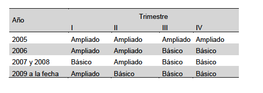

R para usar la ENOE
================
AE
21/3/2019

-   [La Encuesta](#la-encuesta)
-   [Formato de presentación](#formato-de-presentación)
-   [Previo](#previo)
-   [Importación](#importación)
    -   [Formato dbf](#formato-dbf)
    -   [Formato dta y sav](#formato-dta-y-sav)
-   [Aplicaciones](#aplicaciones)
    -   [Ingresos](#ingresos)
    -   [Ocupaciones](#ocupaciones)
    -   [Recodificación](#recodificación)
    -   [Regresión lineal](#regresión-lineal)

La Encuesta
===========

> La Encuesta Nacional de Ocupación y Empleo (ENOE) es hoy día la encuesta continua levantada en hogares más grande que se aplica en el país. Su puesta en marcha en enero del 2005 marcó el fin de un modelo de captación y procesamiento que tuvo vigencia durante 20 años, el cual correspondió a la Encuesta Nacional de Empleo Urbano (ENEU) seguida por la Encuesta Nacional de Empleo (ENE) en donde aquélla quedó integrada. (INEGI, 2007)

Esta fuente es esencial al estudio de los mercados de trabajo en México. La muestre permite hablar de zonas urbanas y rurales y de un listado de ciudades auto-representadas.

Formato de presentación
=======================

La base de datos era publicada en .dbf hasta un par de años. Hoy en día se presenta en cuatro formatos
<li>
.csv
</li>
<li>
.dta
</li>
<li>
.sav
</li>
<li>
.dbf
</li>
 <https://www.inegi.org.mx/programas/enoe/15ymas/default.html#Microdatos>

Vamos a importar los archivos desde tres tipos de formato, utilizando el cuarto trimestre de 2018. Podemos descargarlos desde acá: <https://www.inegi.org.mx/contenidos/programas/enoe/15ymas/microdatos/2018trim4_csv.zip> <https://www.inegi.org.mx/contenidos/programas/enoe/15ymas/microdatos/2018trim4_dta.zip> <https://www.inegi.org.mx/contenidos/programas/enoe/15ymas/microdatos/2018trim4_sav.zip> <https://www.inegi.org.mx/contenidos/programas/enoe/15ymas/microdatos/2018trim4_dbf.zip>

Si hay problemas de conectividad, también está este link: <https://www.dropbox.com/sh/6teuof549tz6qf3/AAAgRlrtwa2Z9ys9uepr5vt4a?dl=0>

Independientemente del formato, la ENOE tiene cinco tablas 

En este caso estamos trabajado con el cuestionario básico. Hay también un cuestionario ampliado que se aplica a los individuos al menos una vez en las cinco visitas, segúne ste calendario 

Previo
======

Primero establecemos un directorio de trabajo, donde será más facil importar nuestros datos.

``` r
setwd("~/Dropbox/2019/RLadies")
```

También vamos a trabajar con estos paquetes, habrá que instalarlos si no los tenemos instalados

``` r
paquetes<-c("foreign","tidyverse", "sjlabelled", "stargazer", "sjPlot")
```

Y con este código instalamos:

``` r
nuevos.paquetes<- paquetes[!(paquetes %in% installed.packages()[,"Package"])]
if(length(nuevos.paquetes)) install.packages(nuevos.paquetes)
```

Importación
===========

Formato dbf
-----------

Vamos a importarlo desde dbf. Este formato es más estable en el tiempo, si se quieren construir series. En mi experiencia, he notado que en .dta y .sav se pueden encontrar cambios en la codificación.

``` r
library(foreign)
sdemt418<-read.dbf("SDEMT418.dbf")
```

Vamos a revisar la base, con glipmse (parte de dplyr de tidyverse)

``` r
library(dplyr)
```

    ## Warning: package 'dplyr' was built under R version 3.5.2

    ## 
    ## Attaching package: 'dplyr'

    ## The following objects are masked from 'package:stats':
    ## 
    ##     filter, lag

    ## The following objects are masked from 'package:base':
    ## 
    ##     intersect, setdiff, setequal, union

``` r
glimpse(sdemt418)
```

    ## Observations: 390,612
    ## Variables: 104
    ## $ R_DEF      <fct> 00, 00, 00, 00, 00, 00, 00, 00, 00, 00, 00, 00, 00, 0…
    ## $ LOC        <fct> 0001, 0001, 0001, 0001, 0001, 0001, 0001, 0001, 0001,…
    ## $ MUN        <fct> 002, 002, 010, 017, 010, 006, 007, 007, 012, 012, 015…
    ## $ EST        <fct> 10, 10, 30, 30, 30, 30, 20, 20, 30, 40, 20, 20, 20, 4…
    ## $ EST_D      <int> 109, 109, 111, 111, 111, 111, 110, 110, 111, 112, 110…
    ## $ AGEB       <fct> 00000, 00000, 00000, 00000, 00000, 00000, 00000, 0000…
    ## $ T_LOC      <fct> 1, 1, 1, 1, 1, 1, 1, 1, 1, 1, 1, 1, 1, 1, 1, 1, 1, 1,…
    ## $ CD_A       <fct> 01, 01, 01, 01, 01, 01, 01, 01, 01, 01, 01, 01, 01, 0…
    ## $ ENT        <fct> 09, 09, 09, 09, 09, 09, 09, 09, 09, 09, 09, 09, 09, 0…
    ## $ CON        <fct> 40001, 40001, 40002, 40004, 40006, 40010, 40014, 4001…
    ## $ UPM        <fct> 0900471, 0900471, 0912063, 0920150, 0911752, 0906668,…
    ## $ D_SEM      <fct> 101, 101, 101, 101, 101, 101, 201, 201, 201, 201, 201…
    ## $ N_PRO_VIV  <fct> 0009, 0090, 0068, 0070, 0041, 0037, 0131, 0041, 0003,…
    ## $ V_SEL      <fct> 01, 04, 05, 04, 02, 05, 01, 03, 01, 01, 01, 02, 03, 0…
    ## $ N_HOG      <fct> 1, 1, 1, 1, 1, 1, 1, 1, 1, 1, 1, 1, 1, 1, 1, 1, 1, 1,…
    ## $ H_MUD      <fct> 0, 0, 1, 0, 0, 0, 0, 0, 0, 0, 0, 0, 0, 0, 0, 0, 0, 0,…
    ## $ N_ENT      <fct> 5, 5, 5, 5, 5, 5, 4, 4, 4, 4, 4, 4, 4, 3, 3, 3, 3, 3,…
    ## $ PER        <fct> 418, 418, 418, 418, 418, 418, 418, 418, 418, 418, 418…
    ## $ N_REN      <fct> 02, 03, 07, 03, 02, 01, 01, 03, 02, 01, 03, 01, 04, 0…
    ## $ C_RES      <fct> 1, 1, 1, 1, 1, 1, 1, 1, 1, 1, 1, 1, 1, 1, 1, 1, 1, 1,…
    ## $ PAR_C      <fct> 201, 301, 403, 301, 301, 101, 101, 301, 201, 101, 301…
    ## $ SEX        <fct> 2, 2, 2, 1, 1, 1, 2, 2, 2, 2, 2, 2, 1, 1, 2, 1, 1, 2,…
    ## $ EDA        <fct> 48, 12, 74, 44, 28, 27, 37, 51, 55, 46, 11, 74, 25, 6…
    ## $ NAC_DIA    <fct> 04, 03, 30, 12, 23, 09, 21, 31, 18, 05, 26, 10, 17, 3…
    ## $ NAC_MES    <fct> 07, 06, 04, 07, 03, 06, 02, 10, 02, 09, 12, 05, 12, 1…
    ## $ NAC_ANIO   <fct> 1970, 2006, 1944, 1974, 1990, 1991, 1981, 1966, 1963,…
    ## $ L_NAC_C    <fct> 009, 009, 009, 009, 009, 021, 020, 017, 009, 009, 009…
    ## $ CS_P12     <fct> 1, 1, 1, 1, 1, 1, 1, 1, 1, 1, 1, 1, 1, 1, 1, 1, 1, 1,…
    ## $ CS_P13_1   <fct> 08, 02, 06, 07, 07, 04, 02, 04, 02, 07, 02, 02, 07, 0…
    ## $ CS_P13_2   <fct> 2, 5, 2, 5, 5, 3, 6, 3, 6, 4, 5, 6, 2, 4, 2, 3, 2, 2,…
    ## $ CS_P14_C   <fct> 7713, NA, 2814, 5517, 5999, NA, NA, NA, NA, 5111, NA,…
    ## $ CS_P15     <fct> NA, NA, 2, 3, 3, NA, NA, NA, NA, 3, NA, NA, 3, 3, 3, …
    ## $ CS_P16     <fct> 1, NA, 1, 1, 1, NA, NA, NA, NA, 1, NA, NA, 2, 1, 2, N…
    ## $ CS_P17     <fct> 2, 1, 2, 2, 2, 2, 2, 2, 2, 2, 1, 2, 1, 2, 2, 2, 1, 2,…
    ## $ N_HIJ      <fct> 02, 00, 00, NA, NA, NA, 02, 00, 02, 01, NA, 06, NA, N…
    ## $ E_CON      <fct> 5, 6, 6, 6, 6, 1, 1, 6, 5, 3, NA, 6, 6, 6, 5, 1, NA, …
    ## $ CS_AD_MOT  <fct> NA, NA, NA, NA, NA, NA, NA, NA, NA, NA, NA, NA, NA, N…
    ## $ CS_P20_DES <fct> NA, NA, NA, NA, NA, NA, NA, NA, NA, NA, NA, NA, NA, N…
    ## $ CS_AD_DES  <fct> NA, NA, NA, NA, NA, NA, NA, NA, NA, NA, NA, NA, NA, N…
    ## $ CS_NR_MOT  <fct> NA, NA, NA, NA, NA, NA, NA, NA, NA, NA, NA, NA, NA, N…
    ## $ CS_P22_DES <fct> NA, NA, NA, NA, NA, NA, NA, NA, NA, NA, NA, NA, NA, N…
    ## $ CS_NR_ORI  <fct> NA, NA, NA, NA, NA, NA, NA, NA, NA, NA, NA, NA, NA, N…
    ## $ UR         <int> 1, 1, 1, 1, 1, 1, 1, 1, 1, 1, 1, 1, 1, 1, 1, 1, 1, 1,…
    ## $ ZONA       <int> 1, 1, 1, 1, 1, 1, 1, 1, 1, 1, 1, 1, 1, 1, 1, 1, 1, 1,…
    ## $ SALARIO    <int> 2651, 2651, 2651, 2651, 2651, 2651, 2651, 2651, 2651,…
    ## $ FAC        <int> 482, 482, 568, 970, 1028, 966, 879, 948, 1259, 978, 9…
    ## $ CLASE1     <int> 1, 2, 1, 1, 1, 1, 1, 1, 2, 1, 0, 2, 1, 2, 1, 1, 0, 1,…
    ## $ CLASE2     <int> 1, 4, 1, 1, 1, 1, 1, 1, 4, 1, 0, 3, 1, 4, 1, 1, 0, 1,…
    ## $ CLASE3     <int> 1, 0, 1, 1, 1, 1, 1, 1, 0, 1, 0, 0, 1, 0, 1, 1, 0, 1,…
    ## $ POS_OCU    <int> 1, 0, 1, 1, 1, 1, 1, 1, 0, 1, 0, 0, 1, 0, 1, 1, 0, 1,…
    ## $ SEG_SOC    <int> 1, 0, 1, 1, 2, 2, 2, 1, 0, 2, 0, 0, 1, 0, 2, 2, 0, 2,…
    ## $ RAMA       <int> 4, 0, 4, 4, 4, 3, 2, 2, 0, 4, 0, 0, 4, 0, 7, 4, 0, 4,…
    ## $ C_OCU11C   <int> 1, 0, 4, 1, 3, 8, 5, 4, 0, 1, 0, 0, 4, 0, 6, 7, 0, 8,…
    ## $ ING7C      <int> 7, 0, 7, 4, 3, 3, 2, 4, 0, 5, 0, 0, 3, 0, 1, 2, 0, 1,…
    ## $ DUR9C      <int> 4, 0, 6, 6, 2, 8, 8, 6, 0, 4, 0, 0, 4, 0, 2, 4, 0, 7,…
    ## $ EMPLE7C    <int> 5, 0, 6, 6, 7, 2, 2, 6, 0, 6, 0, 0, 5, 0, 2, 2, 0, 1,…
    ## $ MEDICA5C   <int> 3, 0, 3, 3, 5, 1, 4, 3, 0, 1, 0, 0, 3, 0, 1, 1, 0, 4,…
    ## $ BUSCAR5C   <int> 4, 0, 4, 4, 4, 4, 4, 4, 0, 3, 0, 0, 4, 0, 4, 1, 0, 4,…
    ## $ RAMA_EST1  <int> 3, 0, 3, 3, 3, 3, 2, 2, 0, 3, 0, 0, 3, 0, 4, 3, 0, 3,…
    ## $ RAMA_EST2  <int> 9, 0, 11, 8, 10, 5, 3, 3, 0, 11, 0, 0, 9, 0, 0, 7, 0,…
    ## $ DUR_EST    <int> 3, 0, 4, 4, 2, 5, 5, 4, 0, 3, 0, 0, 3, 0, 2, 3, 0, 5,…
    ## $ AMBITO1    <int> 2, 0, 2, 2, 3, 2, 2, 2, 0, 2, 0, 0, 2, 0, 2, 2, 0, 2,…
    ## $ AMBITO2    <int> 4, 0, 7, 5, 0, 3, 3, 5, 0, 7, 0, 0, 4, 0, 8, 2, 0, 8,…
    ## $ TUE1       <int> 2, 0, 2, 1, 2, 1, 3, 1, 0, 2, 0, 0, 1, 0, 4, 3, 0, 3,…
    ## $ TUE2       <int> 3, 0, 4, 1, 3, 2, 5, 1, 0, 4, 0, 0, 1, 0, 0, 5, 0, 6,…
    ## $ TUE3       <int> 0, 0, 1, 0, 0, 0, 0, 0, 0, 2, 0, 0, 0, 0, 0, 0, 0, 0,…
    ## $ BUSQUEDA   <int> 2, 0, 2, 2, 2, 2, 2, 2, 0, 2, 0, 0, 2, 0, 2, 1, 0, 2,…
    ## $ D_ANT_LAB  <int> 0, 0, 0, 0, 0, 0, 0, 0, 0, 0, 0, 0, 0, 0, 0, 0, 0, 0,…
    ## $ D_CEXP_EST <int> 0, 0, 0, 0, 0, 0, 0, 0, 0, 0, 0, 0, 0, 0, 0, 0, 0, 0,…
    ## $ DUR_DES    <int> 0, 0, 0, 0, 0, 0, 0, 0, 0, 0, 0, 0, 0, 0, 0, 0, 0, 0,…
    ## $ SUB_O      <int> 0, 0, 0, 0, 0, 0, 0, 0, 0, 0, 0, 0, 0, 0, 0, 1, 0, 0,…
    ## $ S_CLASIFI  <int> 0, 0, 0, 0, 0, 0, 0, 0, 0, 0, 0, 0, 0, 0, 0, 5, 0, 0,…
    ## $ REMUNE2C   <int> 1, 0, 1, 1, 1, 2, 1, 1, 0, 1, 0, 0, 1, 0, 2, 2, 0, 1,…
    ## $ PRE_ASA    <int> 1, 0, 1, 1, 3, 2, 1, 1, 0, 2, 0, 0, 1, 0, 2, 2, 0, 1,…
    ## $ TIP_CON    <int> 3, 0, 3, 6, 6, 5, 5, 3, 0, 5, 0, 0, 3, 0, 5, 5, 0, 5,…
    ## $ DISPO      <int> 0, 0, 0, 0, 0, 0, 0, 0, 0, 0, 0, 4, 0, 0, 0, 0, 0, 0,…
    ## $ NODISPO    <int> 0, 3, 0, 0, 0, 0, 0, 0, 3, 0, 0, 0, 0, 2, 0, 0, 0, 0,…
    ## $ C_INAC5C   <int> 0, 1, 0, 0, 0, 0, 0, 0, 2, 0, 0, 2, 0, 4, 0, 0, 0, 0,…
    ## $ PNEA_EST   <int> 0, 4, 0, 0, 0, 0, 0, 0, 4, 0, 0, 2, 0, 5, 0, 0, 0, 0,…
    ## $ NIV_INS    <int> 4, 1, 3, 4, 4, 4, 2, 4, 2, 4, 1, 2, 4, 4, 4, 3, 1, 3,…
    ## $ EDA5C      <int> 3, 0, 4, 2, 2, 2, 2, 3, 3, 3, 0, 4, 2, 3, 2, 4, 0, 3,…
    ## $ EDA7C      <int> 4, 0, 6, 4, 2, 2, 3, 5, 5, 4, 0, 6, 2, 6, 4, 6, 0, 4,…
    ## $ EDA12C     <int> 7, 0, 11, 6, 3, 3, 5, 8, 9, 7, 0, 11, 3, 10, 6, 11, 0…
    ## $ EDA19C     <int> 12, 5, 17, 11, 8, 8, 10, 13, 14, 12, 4, 17, 8, 15, 11…
    ## $ HIJ5C      <int> 2, 1, 1, 0, 0, 0, 2, 1, 2, 2, 0, 4, 0, 0, 2, 0, 0, 2,…
    ## $ DOMESTICO  <int> 3, 7, 3, 3, 1, 3, 3, 3, 8, 3, 0, 8, 2, 6, 3, 3, 0, 1,…
    ## $ ANIOS_ESC  <int> 18, 5, 11, 17, 17, 12, 6, 12, 6, 16, 0, 6, 14, 16, 14…
    ## $ HRSOCUP    <int> 30, 0, 40, 40, 12, 77, 70, 45, 0, 30, 0, 0, 25, 0, 11…
    ## $ INGOCUP    <int> 0, 0, 0, 0, 7000, 6000, 4300, 10000, 0, 20000, 0, 0, …
    ## $ ING_X_HRS  <dbl> 0.00000, 0.00000, 0.00000, 0.00000, 135.65891, 18.121…
    ## $ TPG_P8A    <int> 0, 0, 0, 0, 0, 0, 0, 0, 0, 1, 0, 0, 0, 0, 0, 1, 0, 0,…
    ## $ TCCO       <int> 0, 0, 0, 0, 0, 0, 3, 0, 0, 0, 0, 0, 0, 0, 0, 0, 0, 2,…
    ## $ CP_ANOC    <int> 0, 0, 0, 0, 0, 0, 0, 0, 0, 0, 0, 0, 0, 0, 0, 0, 0, 0,…
    ## $ IMSSISSSTE <int> 1, 0, 2, 1, 4, 4, 4, 1, 0, 4, 0, 0, 1, 0, 4, 4, 0, 4,…
    ## $ MA48ME1SM  <int> 0, 0, 0, 0, 0, 0, 0, 0, 0, 0, 0, 0, 0, 0, 0, 0, 0, 0,…
    ## $ P14APOYOS  <int> 0, 0, 0, 0, 0, 0, 0, 0, 0, 0, 0, 0, 0, 0, 0, 0, 0, 0,…
    ## $ SCIAN      <int> 16, 0, 20, 12, 19, 7, 5, 5, 0, 20, 0, 0, 15, 0, 21, 8…
    ## $ T_TRA      <int> 1, 1, 1, 1, 1, 1, 1, 1, 1, 1, 0, 1, 1, 1, 1, 1, 0, 1,…
    ## $ EMP_PPAL   <int> 2, 0, 2, 2, 1, 1, 1, 2, 0, 1, 0, 0, 2, 0, 1, 1, 0, 1,…
    ## $ TUE_PPAL   <int> 2, 0, 2, 2, 2, 2, 1, 2, 0, 2, 0, 0, 2, 0, 2, 1, 0, 2,…
    ## $ TRANS_PPAL <int> 0, 0, 0, 0, 0, 0, 0, 0, 0, 0, 0, 0, 0, 0, 0, 0, 0, 0,…
    ## $ MH_FIL2    <int> 3, 0, 3, 3, 3, 3, 1, 3, 0, 3, 0, 0, 3, 0, 3, 1, 0, 2,…
    ## $ MH_COL     <int> 2, 0, 2, 2, 1, 3, 1, 2, 0, 1, 0, 0, 2, 0, 3, 3, 0, 1,…
    ## $ SEC_INS    <int> 6, 0, 5, 2, 6, 4, 8, 2, 0, 5, 0, 0, 2, 0, 11, 8, 0, 9…

``` r
class(sdemt418) # tipo de objeto
```

    ## [1] "data.frame"

``` r
names(sdemt418) # lista las variables
```

    ##   [1] "R_DEF"      "LOC"        "MUN"        "EST"        "EST_D"     
    ##   [6] "AGEB"       "T_LOC"      "CD_A"       "ENT"        "CON"       
    ##  [11] "UPM"        "D_SEM"      "N_PRO_VIV"  "V_SEL"      "N_HOG"     
    ##  [16] "H_MUD"      "N_ENT"      "PER"        "N_REN"      "C_RES"     
    ##  [21] "PAR_C"      "SEX"        "EDA"        "NAC_DIA"    "NAC_MES"   
    ##  [26] "NAC_ANIO"   "L_NAC_C"    "CS_P12"     "CS_P13_1"   "CS_P13_2"  
    ##  [31] "CS_P14_C"   "CS_P15"     "CS_P16"     "CS_P17"     "N_HIJ"     
    ##  [36] "E_CON"      "CS_AD_MOT"  "CS_P20_DES" "CS_AD_DES"  "CS_NR_MOT" 
    ##  [41] "CS_P22_DES" "CS_NR_ORI"  "UR"         "ZONA"       "SALARIO"   
    ##  [46] "FAC"        "CLASE1"     "CLASE2"     "CLASE3"     "POS_OCU"   
    ##  [51] "SEG_SOC"    "RAMA"       "C_OCU11C"   "ING7C"      "DUR9C"     
    ##  [56] "EMPLE7C"    "MEDICA5C"   "BUSCAR5C"   "RAMA_EST1"  "RAMA_EST2" 
    ##  [61] "DUR_EST"    "AMBITO1"    "AMBITO2"    "TUE1"       "TUE2"      
    ##  [66] "TUE3"       "BUSQUEDA"   "D_ANT_LAB"  "D_CEXP_EST" "DUR_DES"   
    ##  [71] "SUB_O"      "S_CLASIFI"  "REMUNE2C"   "PRE_ASA"    "TIP_CON"   
    ##  [76] "DISPO"      "NODISPO"    "C_INAC5C"   "PNEA_EST"   "NIV_INS"   
    ##  [81] "EDA5C"      "EDA7C"      "EDA12C"     "EDA19C"     "HIJ5C"     
    ##  [86] "DOMESTICO"  "ANIOS_ESC"  "HRSOCUP"    "INGOCUP"    "ING_X_HRS" 
    ##  [91] "TPG_P8A"    "TCCO"       "CP_ANOC"    "IMSSISSSTE" "MA48ME1SM" 
    ##  [96] "P14APOYOS"  "SCIAN"      "T_TRA"      "EMP_PPAL"   "TUE_PPAL"  
    ## [101] "TRANS_PPAL" "MH_FIL2"    "MH_COL"     "SEC_INS"

``` r
head(sdemt418) # muestra las primeras 6 líneas
```

    ##   R_DEF  LOC MUN EST EST_D  AGEB T_LOC CD_A ENT   CON     UPM D_SEM
    ## 1    00 0001 002  10   109 00000     1   01  09 40001 0900471   101
    ## 2    00 0001 002  10   109 00000     1   01  09 40001 0900471   101
    ## 3    00 0001 010  30   111 00000     1   01  09 40002 0912063   101
    ## 4    00 0001 017  30   111 00000     1   01  09 40004 0920150   101
    ## 5    00 0001 010  30   111 00000     1   01  09 40006 0911752   101
    ## 6    00 0001 006  30   111 00000     1   01  09 40010 0906668   101
    ##   N_PRO_VIV V_SEL N_HOG H_MUD N_ENT PER N_REN C_RES PAR_C SEX EDA NAC_DIA
    ## 1      0009    01     1     0     5 418    02     1   201   2  48      04
    ## 2      0090    04     1     0     5 418    03     1   301   2  12      03
    ## 3      0068    05     1     1     5 418    07     1   403   2  74      30
    ## 4      0070    04     1     0     5 418    03     1   301   1  44      12
    ## 5      0041    02     1     0     5 418    02     1   301   1  28      23
    ## 6      0037    05     1     0     5 418    01     1   101   1  27      09
    ##   NAC_MES NAC_ANIO L_NAC_C CS_P12 CS_P13_1 CS_P13_2 CS_P14_C CS_P15 CS_P16
    ## 1      07     1970     009      1       08        2     7713   <NA>      1
    ## 2      06     2006     009      1       02        5     <NA>   <NA>   <NA>
    ## 3      04     1944     009      1       06        2     2814      2      1
    ## 4      07     1974     009      1       07        5     5517      3      1
    ## 5      03     1990     009      1       07        5     5999      3      1
    ## 6      06     1991     021      1       04        3     <NA>   <NA>   <NA>
    ##   CS_P17 N_HIJ E_CON CS_AD_MOT CS_P20_DES CS_AD_DES CS_NR_MOT CS_P22_DES
    ## 1      2    02     5      <NA>       <NA>      <NA>      <NA>       <NA>
    ## 2      1    00     6      <NA>       <NA>      <NA>      <NA>       <NA>
    ## 3      2    00     6      <NA>       <NA>      <NA>      <NA>       <NA>
    ## 4      2  <NA>     6      <NA>       <NA>      <NA>      <NA>       <NA>
    ## 5      2  <NA>     6      <NA>       <NA>      <NA>      <NA>       <NA>
    ## 6      2  <NA>     1      <NA>       <NA>      <NA>      <NA>       <NA>
    ##   CS_NR_ORI UR ZONA SALARIO  FAC CLASE1 CLASE2 CLASE3 POS_OCU SEG_SOC RAMA
    ## 1      <NA>  1    1    2651  482      1      1      1       1       1    4
    ## 2      <NA>  1    1    2651  482      2      4      0       0       0    0
    ## 3      <NA>  1    1    2651  568      1      1      1       1       1    4
    ## 4      <NA>  1    1    2651  970      1      1      1       1       1    4
    ## 5      <NA>  1    1    2651 1028      1      1      1       1       2    4
    ## 6      <NA>  1    1    2651  966      1      1      1       1       2    3
    ##   C_OCU11C ING7C DUR9C EMPLE7C MEDICA5C BUSCAR5C RAMA_EST1 RAMA_EST2
    ## 1        1     7     4       5        3        4         3         9
    ## 2        0     0     0       0        0        0         0         0
    ## 3        4     7     6       6        3        4         3        11
    ## 4        1     4     6       6        3        4         3         8
    ## 5        3     3     2       7        5        4         3        10
    ## 6        8     3     8       2        1        4         3         5
    ##   DUR_EST AMBITO1 AMBITO2 TUE1 TUE2 TUE3 BUSQUEDA D_ANT_LAB D_CEXP_EST
    ## 1       3       2       4    2    3    0        2         0          0
    ## 2       0       0       0    0    0    0        0         0          0
    ## 3       4       2       7    2    4    1        2         0          0
    ## 4       4       2       5    1    1    0        2         0          0
    ## 5       2       3       0    2    3    0        2         0          0
    ## 6       5       2       3    1    2    0        2         0          0
    ##   DUR_DES SUB_O S_CLASIFI REMUNE2C PRE_ASA TIP_CON DISPO NODISPO C_INAC5C
    ## 1       0     0         0        1       1       3     0       0        0
    ## 2       0     0         0        0       0       0     0       3        1
    ## 3       0     0         0        1       1       3     0       0        0
    ## 4       0     0         0        1       1       6     0       0        0
    ## 5       0     0         0        1       3       6     0       0        0
    ## 6       0     0         0        2       2       5     0       0        0
    ##   PNEA_EST NIV_INS EDA5C EDA7C EDA12C EDA19C HIJ5C DOMESTICO ANIOS_ESC
    ## 1        0       4     3     4      7     12     2         3        18
    ## 2        4       1     0     0      0      5     1         7         5
    ## 3        0       3     4     6     11     17     1         3        11
    ## 4        0       4     2     4      6     11     0         3        17
    ## 5        0       4     2     2      3      8     0         1        17
    ## 6        0       4     2     2      3      8     0         3        12
    ##   HRSOCUP INGOCUP ING_X_HRS TPG_P8A TCCO CP_ANOC IMSSISSSTE MA48ME1SM
    ## 1      30       0   0.00000       0    0       0          1         0
    ## 2       0       0   0.00000       0    0       0          0         0
    ## 3      40       0   0.00000       0    0       0          2         0
    ## 4      40       0   0.00000       0    0       0          1         0
    ## 5      12    7000 135.65891       0    0       0          4         0
    ## 6      77    6000  18.12141       0    0       0          4         0
    ##   P14APOYOS SCIAN T_TRA EMP_PPAL TUE_PPAL TRANS_PPAL MH_FIL2 MH_COL
    ## 1         0    16     1        2        2          0       3      2
    ## 2         0     0     1        0        0          0       0      0
    ## 3         0    20     1        2        2          0       3      2
    ## 4         0    12     1        2        2          0       3      2
    ## 5         0    19     1        1        2          0       3      1
    ## 6         0     7     1        1        2          0       3      3
    ##   SEC_INS
    ## 1       6
    ## 2       0
    ## 3       5
    ## 4       2
    ## 5       6
    ## 6       4

``` r
table(sdemt418$CLASE1) # un tabulado simple
```

    ## 
    ##      0      1      2 
    ##  81561 177017 132034

Formato dta y sav
-----------------

La ventaja de trabajar con estos formatos, es que INEGI ha etiquetado las variables. INEGI trabaja con versiones bastante nuevas de STATA y de SPSS por lo que el paquete foreign no se puede utilizar.

Vamos a importarlo con el paquete "haven", parte de "tidyverse"

``` r
library(haven)
sdemt418<-read_spss("SDEMT418.sav")
sdemt418<-read_dta("SDEMT418.dta")
```

Nuevamente podemos revisarla y veremos algunas diferencias:

``` r
glimpse(sdemt418) # revisar la estructura
```

    ## Observations: 390,612
    ## Variables: 104
    ## $ r_def      <dbl+lbl> 0, 0, 0, 0, 0, 0, 0, 0, 0, 0, 0, 0, 0, 0, 0, 0, 0…
    ## $ loc        <dbl> 1, 1, 1, 1, 1, 1, 1, 1, 1, 1, 1, 1, 1, 1, 1, 1, 1, 1,…
    ## $ mun        <dbl> 2, 2, 10, 17, 10, 6, 7, 7, 12, 12, 15, 15, 15, 3, 3, …
    ## $ est        <dbl> 10, 10, 30, 30, 30, 30, 20, 20, 30, 40, 20, 20, 20, 4…
    ## $ est_d      <dbl> 109, 109, 111, 111, 111, 111, 110, 110, 111, 112, 110…
    ## $ ageb       <dbl> 0, 0, 0, 0, 0, 0, 0, 0, 0, 0, 0, 0, 0, 0, 0, 0, 0, 0,…
    ## $ t_loc      <dbl+lbl> 1, 1, 1, 1, 1, 1, 1, 1, 1, 1, 1, 1, 1, 1, 1, 1, 1…
    ## $ cd_a       <dbl+lbl> 1, 1, 1, 1, 1, 1, 1, 1, 1, 1, 1, 1, 1, 1, 1, 1, 1…
    ## $ ent        <dbl+lbl> 9, 9, 9, 9, 9, 9, 9, 9, 9, 9, 9, 9, 9, 9, 9, 9, 9…
    ## $ con        <dbl> 40001, 40001, 40002, 40004, 40006, 40010, 40014, 4001…
    ## $ upm        <dbl> 900471, 900471, 912063, 920150, 911752, 906668, 90780…
    ## $ d_sem      <dbl+lbl> 101, 101, 101, 101, 101, 101, 201, 201, 201, 201,…
    ## $ n_pro_viv  <dbl> 9, 90, 68, 70, 41, 37, 131, 41, 3, 65, 18, 46, 70, 89…
    ## $ v_sel      <dbl+lbl> 1, 4, 5, 4, 2, 5, 1, 3, 1, 1, 1, 2, 3, 2, 3, 3, 3…
    ## $ n_hog      <dbl+lbl> 1, 1, 1, 1, 1, 1, 1, 1, 1, 1, 1, 1, 1, 1, 1, 1, 1…
    ## $ h_mud      <dbl+lbl> 0, 0, 1, 0, 0, 0, 0, 0, 0, 0, 0, 0, 0, 0, 0, 0, 0…
    ## $ n_ent      <dbl+lbl> 5, 5, 5, 5, 5, 5, 4, 4, 4, 4, 4, 4, 4, 3, 3, 3, 3…
    ## $ per        <dbl+lbl> 418, 418, 418, 418, 418, 418, 418, 418, 418, 418,…
    ## $ n_ren      <dbl+lbl> 2, 3, 7, 3, 2, 1, 1, 3, 2, 1, 3, 1, 4, 2, 2, 2, 6…
    ## $ c_res      <dbl+lbl> 1, 1, 1, 1, 1, 1, 1, 1, 1, 1, 1, 1, 1, 1, 1, 1, 1…
    ## $ par_c      <dbl> 201, 301, 403, 301, 301, 101, 101, 301, 201, 101, 301…
    ## $ sex        <dbl+lbl> 2, 2, 2, 1, 1, 1, 2, 2, 2, 2, 2, 2, 1, 1, 2, 1, 1…
    ## $ eda        <dbl> 48, 12, 74, 44, 28, 27, 37, 51, 55, 46, 11, 74, 25, 6…
    ## $ nac_dia    <dbl+lbl> 4, 3, 30, 12, 23, 9, 21, 31, 18, 5, 26, 10, 17, 3…
    ## $ nac_mes    <dbl+lbl> 7, 6, 4, 7, 3, 6, 2, 10, 2, 9, 12, 5, 12, 12, 4, …
    ## $ nac_anio   <dbl> 1970, 2006, 1944, 1974, 1990, 1991, 1981, 1966, 1963,…
    ## $ l_nac_c    <dbl+lbl> 9, 9, 9, 9, 9, 21, 20, 17, 9, 9, 9, 9, 9, 9, 9, 9…
    ## $ cs_p12     <dbl+lbl> 1, 1, 1, 1, 1, 1, 1, 1, 1, 1, 1, 1, 1, 1, 1, 1, 1…
    ## $ cs_p13_1   <dbl+lbl> 8, 2, 6, 7, 7, 4, 2, 4, 2, 7, 2, 2, 7, 7, 7, 3, 2…
    ## $ cs_p13_2   <dbl+lbl> 2, 5, 2, 5, 5, 3, 6, 3, 6, 4, 5, 6, 2, 4, 2, 3, 2…
    ## $ cs_p14_c   <chr> "7713", "", "2814", "5517", "5999", "", "", "", "", "…
    ## $ cs_p15     <dbl+lbl> NA, NA, 2, 3, 3, NA, NA, NA, NA, 3, NA, NA, 3, 3,…
    ## $ cs_p16     <dbl+lbl> 1, NA, 1, 1, 1, NA, NA, NA, NA, 1, NA, NA, 2, 1, …
    ## $ cs_p17     <dbl+lbl> 2, 1, 2, 2, 2, 2, 2, 2, 2, 2, 1, 2, 1, 2, 2, 2, 1…
    ## $ n_hij      <dbl+lbl> 2, 0, 0, NA, NA, NA, 2, 0, 2, 1, NA, 6, NA, NA, 2…
    ## $ e_con      <dbl+lbl> 5, 6, 6, 6, 6, 1, 1, 6, 5, 3, NA, 6, 6, 6, 5, 1, …
    ## $ cs_ad_mot  <dbl+lbl> NA, NA, NA, NA, NA, NA, NA, NA, NA, NA, NA, NA, N…
    ## $ cs_p20_des <chr> "", "", "", "", "", "", "", "", "", "", "", "", "", "…
    ## $ cs_ad_des  <dbl+lbl> NA, NA, NA, NA, NA, NA, NA, NA, NA, NA, NA, NA, N…
    ## $ cs_nr_mot  <dbl+lbl> NA, NA, NA, NA, NA, NA, NA, NA, NA, NA, NA, NA, N…
    ## $ cs_p22_des <chr> "", "", "", "", "", "", "", "", "", "", "", "", "", "…
    ## $ cs_nr_ori  <dbl+lbl> NA, NA, NA, NA, NA, NA, NA, NA, NA, NA, NA, NA, N…
    ## $ ur         <dbl+lbl> 1, 1, 1, 1, 1, 1, 1, 1, 1, 1, 1, 1, 1, 1, 1, 1, 1…
    ## $ zona       <dbl+lbl> 1, 1, 1, 1, 1, 1, 1, 1, 1, 1, 1, 1, 1, 1, 1, 1, 1…
    ## $ salario    <dbl> 2651, 2651, 2651, 2651, 2651, 2651, 2651, 2651, 2651,…
    ## $ fac        <dbl> 482, 482, 568, 970, 1028, 966, 879, 948, 1259, 978, 9…
    ## $ clase1     <dbl+lbl> 1, 2, 1, 1, 1, 1, 1, 1, 2, 1, 0, 2, 1, 2, 1, 1, 0…
    ## $ clase2     <dbl+lbl> 1, 4, 1, 1, 1, 1, 1, 1, 4, 1, 0, 3, 1, 4, 1, 1, 0…
    ## $ clase3     <dbl+lbl> 1, 0, 1, 1, 1, 1, 1, 1, 0, 1, 0, 0, 1, 0, 1, 1, 0…
    ## $ pos_ocu    <dbl+lbl> 1, 0, 1, 1, 1, 1, 1, 1, 0, 1, 0, 0, 1, 0, 1, 1, 0…
    ## $ seg_soc    <dbl+lbl> 1, 0, 1, 1, 2, 2, 2, 1, 0, 2, 0, 0, 1, 0, 2, 2, 0…
    ## $ rama       <dbl+lbl> 4, 0, 4, 4, 4, 3, 2, 2, 0, 4, 0, 0, 4, 0, 7, 4, 0…
    ## $ c_ocu11c   <dbl+lbl> 1, 0, 4, 1, 3, 8, 5, 4, 0, 1, 0, 0, 4, 0, 6, 7, 0…
    ## $ ing7c      <dbl+lbl> 7, 0, 7, 4, 3, 3, 2, 4, 0, 5, 0, 0, 3, 0, 1, 2, 0…
    ## $ dur9c      <dbl+lbl> 4, 0, 6, 6, 2, 8, 8, 6, 0, 4, 0, 0, 4, 0, 2, 4, 0…
    ## $ emple7c    <dbl+lbl> 5, 0, 6, 6, 7, 2, 2, 6, 0, 6, 0, 0, 5, 0, 2, 2, 0…
    ## $ medica5c   <dbl+lbl> 3, 0, 3, 3, 5, 1, 4, 3, 0, 1, 0, 0, 3, 0, 1, 1, 0…
    ## $ buscar5c   <dbl+lbl> 4, 0, 4, 4, 4, 4, 4, 4, 0, 3, 0, 0, 4, 0, 4, 1, 0…
    ## $ rama_est1  <dbl+lbl> 3, 0, 3, 3, 3, 3, 2, 2, 0, 3, 0, 0, 3, 0, 4, 3, 0…
    ## $ rama_est2  <dbl+lbl> 9, 0, 11, 8, 10, 5, 3, 3, 0, 11, 0, 0, 9, 0, 0, 7…
    ## $ dur_est    <dbl+lbl> 3, 0, 4, 4, 2, 5, 5, 4, 0, 3, 0, 0, 3, 0, 2, 3, 0…
    ## $ ambito1    <dbl+lbl> 2, 0, 2, 2, 3, 2, 2, 2, 0, 2, 0, 0, 2, 0, 2, 2, 0…
    ## $ ambito2    <dbl+lbl> 4, 0, 7, 5, 0, 3, 3, 5, 0, 7, 0, 0, 4, 0, 8, 2, 0…
    ## $ tue1       <dbl+lbl> 2, 0, 2, 1, 2, 1, 3, 1, 0, 2, 0, 0, 1, 0, 4, 3, 0…
    ## $ tue2       <dbl+lbl> 3, 0, 4, 1, 3, 2, 5, 1, 0, 4, 0, 0, 1, 0, 0, 5, 0…
    ## $ tue3       <dbl+lbl> 0, 0, 1, 0, 0, 0, 0, 0, 0, 2, 0, 0, 0, 0, 0, 0, 0…
    ## $ busqueda   <dbl+lbl> 2, 0, 2, 2, 2, 2, 2, 2, 0, 2, 0, 0, 2, 0, 2, 1, 0…
    ## $ d_ant_lab  <dbl+lbl> 0, 0, 0, 0, 0, 0, 0, 0, 0, 0, 0, 0, 0, 0, 0, 0, 0…
    ## $ d_cexp_est <dbl+lbl> 0, 0, 0, 0, 0, 0, 0, 0, 0, 0, 0, 0, 0, 0, 0, 0, 0…
    ## $ dur_des    <dbl+lbl> 0, 0, 0, 0, 0, 0, 0, 0, 0, 0, 0, 0, 0, 0, 0, 0, 0…
    ## $ sub_o      <dbl+lbl> 0, 0, 0, 0, 0, 0, 0, 0, 0, 0, 0, 0, 0, 0, 0, 1, 0…
    ## $ s_clasifi  <dbl+lbl> 0, 0, 0, 0, 0, 0, 0, 0, 0, 0, 0, 0, 0, 0, 0, 5, 0…
    ## $ remune2c   <dbl+lbl> 1, 0, 1, 1, 1, 2, 1, 1, 0, 1, 0, 0, 1, 0, 2, 2, 0…
    ## $ pre_asa    <dbl+lbl> 1, 0, 1, 1, 3, 2, 1, 1, 0, 2, 0, 0, 1, 0, 2, 2, 0…
    ## $ tip_con    <dbl+lbl> 3, 0, 3, 6, 6, 5, 5, 3, 0, 5, 0, 0, 3, 0, 5, 5, 0…
    ## $ dispo      <dbl+lbl> 0, 0, 0, 0, 0, 0, 0, 0, 0, 0, 0, 4, 0, 0, 0, 0, 0…
    ## $ nodispo    <dbl+lbl> 0, 3, 0, 0, 0, 0, 0, 0, 3, 0, 0, 0, 0, 2, 0, 0, 0…
    ## $ c_inac5c   <dbl+lbl> 0, 1, 0, 0, 0, 0, 0, 0, 2, 0, 0, 2, 0, 4, 0, 0, 0…
    ## $ pnea_est   <dbl+lbl> 0, 4, 0, 0, 0, 0, 0, 0, 4, 0, 0, 2, 0, 5, 0, 0, 0…
    ## $ niv_ins    <dbl+lbl> 4, 1, 3, 4, 4, 4, 2, 4, 2, 4, 1, 2, 4, 4, 4, 3, 1…
    ## $ eda5c      <dbl+lbl> 3, 0, 4, 2, 2, 2, 2, 3, 3, 3, 0, 4, 2, 3, 2, 4, 0…
    ## $ eda7c      <dbl+lbl> 4, 0, 6, 4, 2, 2, 3, 5, 5, 4, 0, 6, 2, 6, 4, 6, 0…
    ## $ eda12c     <dbl+lbl> 7, 0, 11, 6, 3, 3, 5, 8, 9, 7, 0, 11, 3, 10, 6, 1…
    ## $ eda19c     <dbl+lbl> 12, 5, 17, 11, 8, 8, 10, 13, 14, 12, 4, 17, 8, 15…
    ## $ hij5c      <dbl+lbl> 2, 1, 1, 0, 0, 0, 2, 1, 2, 2, 0, 4, 0, 0, 2, 0, 0…
    ## $ domestico  <dbl+lbl> 3, 7, 3, 3, 1, 3, 3, 3, 8, 3, 0, 8, 2, 6, 3, 3, 0…
    ## $ anios_esc  <dbl> 18, 5, 11, 17, 17, 12, 6, 12, 6, 16, 0, 6, 14, 16, 14…
    ## $ hrsocup    <dbl> 30, 0, 40, 40, 12, 77, 70, 45, 0, 30, 0, 0, 25, 0, 11…
    ## $ ingocup    <dbl> 0, 0, 0, 0, 7000, 6000, 4300, 10000, 0, 20000, 0, 0, …
    ## $ ing_x_hrs  <dbl> 0.00000, 0.00000, 0.00000, 0.00000, 135.65891, 18.121…
    ## $ tpg_p8a    <dbl+lbl> 0, 0, 0, 0, 0, 0, 0, 0, 0, 1, 0, 0, 0, 0, 0, 1, 0…
    ## $ tcco       <dbl+lbl> 0, 0, 0, 0, 0, 0, 3, 0, 0, 0, 0, 0, 0, 0, 0, 0, 0…
    ## $ cp_anoc    <dbl+lbl> 0, 0, 0, 0, 0, 0, 0, 0, 0, 0, 0, 0, 0, 0, 0, 0, 0…
    ## $ imssissste <dbl+lbl> 1, 0, 2, 1, 4, 4, 4, 1, 0, 4, 0, 0, 1, 0, 4, 4, 0…
    ## $ ma48me1sm  <dbl+lbl> 0, 0, 0, 0, 0, 0, 0, 0, 0, 0, 0, 0, 0, 0, 0, 0, 0…
    ## $ p14apoyos  <dbl+lbl> 0, 0, 0, 0, 0, 0, 0, 0, 0, 0, 0, 0, 0, 0, 0, 0, 0…
    ## $ scian      <dbl+lbl> 16, 0, 20, 12, 19, 7, 5, 5, 0, 20, 0, 0, 15, 0, 2…
    ## $ t_tra      <dbl+lbl> 1, 1, 1, 1, 1, 1, 1, 1, 1, 1, 0, 1, 1, 1, 1, 1, 0…
    ## $ emp_ppal   <dbl+lbl> 2, 0, 2, 2, 1, 1, 1, 2, 0, 1, 0, 0, 2, 0, 1, 1, 0…
    ## $ tue_ppal   <dbl+lbl> 2, 0, 2, 2, 2, 2, 1, 2, 0, 2, 0, 0, 2, 0, 2, 1, 0…
    ## $ trans_ppal <dbl+lbl> 0, 0, 0, 0, 0, 0, 0, 0, 0, 0, 0, 0, 0, 0, 0, 0, 0…
    ## $ mh_fil2    <dbl+lbl> 3, 0, 3, 3, 3, 3, 1, 3, 0, 3, 0, 0, 3, 0, 3, 1, 0…
    ## $ mh_col     <dbl+lbl> 2, 0, 2, 2, 1, 3, 1, 2, 0, 1, 0, 0, 2, 0, 3, 3, 0…
    ## $ sec_ins    <dbl+lbl> 6, 0, 5, 2, 6, 4, 8, 2, 0, 5, 0, 0, 2, 0, 11, 8, …

``` r
class(sdemt418) #clase
```

    ## [1] "tbl_df"     "tbl"        "data.frame"

``` r
table(sdemt418$clase1)
```

    ## 
    ##      0      1      2 
    ##  81561 177017 132034

Vemos que además de un data.frame hay más información. Este tipo de objetos nos permiten hacer tablas tipo tibble en el tidyverse.

También tenemos información sobre las etiquetas. El paquete "sjlabelled" nos ayuda mucho a utilizarlas

``` r
library(sjlabelled)
```

    ## Warning: package 'sjlabelled' was built under R version 3.5.2

    ## 
    ## Attaching package: 'sjlabelled'

    ## The following objects are masked from 'package:haven':
    ## 
    ##     as_factor, read_sas, read_spss, read_stata, write_sas,
    ##     zap_labels

``` r
table(as_label(sdemt418$clase1))
```

    ## 
    ##                          No aplica    Población económicamente activa 
    ##                              81561                             177017 
    ## Población no económicamente activa 
    ##                             132034

Incluso podríamos hacer un nuevo objeto

``` r
sdemt418_label<-as_label(sdemt418)
```

Y a este objeto podemos pedirle las tables y otras fuciones

``` r
class(sdemt418_label)
```

    ## [1] "tbl_df"     "tbl"        "data.frame"

``` r
table(sdemt418_label$clase1)
```

    ## 
    ##                          No aplica    Población económicamente activa 
    ##                              81561                             177017 
    ## Población no económicamente activa 
    ##                             132034

Ojo, las variables cambiarían de propiedades

``` r
class(sdemt418$clase1)
```

    ## [1] "haven_labelled"

``` r
class(sdemt418_label$clase1)
```

    ## [1] "factor"

``` r
summary(sdemt418$clase1)
```

    ##    Min. 1st Qu.  Median    Mean 3rd Qu.    Max. 
    ##   0.000   1.000   1.000   1.129   2.000   2.000

``` r
prop.table(table(sdemt418$clase1))
```

    ## 
    ##         0         1         2 
    ## 0.2088031 0.4531786 0.3380183

``` r
summary(sdemt418_label$clase1)
```

    ##                          No aplica    Población económicamente activa 
    ##                              81561                             177017 
    ## Población no económicamente activa 
    ##                             132034

``` r
prop.table(table(sdemt418_label$clase1))
```

    ## 
    ##                          No aplica    Población económicamente activa 
    ##                          0.2088031                          0.4531786 
    ## Población no económicamente activa 
    ##                          0.3380183

Aplicaciones
============

En esta secciones haremos un par de cálculos para el mercado de trabajo mexicano.

Ingresos
--------

Existen variables calculadas por INEGI para los ingresos que han sido añadidas al cuestionario sociodemográfico.

### Medidas numéricas

Vamos a trabajar con los ingresos por hora "ing\_x\_hrs", ingresos laborales por hora.

``` r
summary(sdemt418$ing_x_hrs)
```

    ##    Min. 1st Qu.  Median    Mean 3rd Qu.    Max. 
    ##    0.00    0.00    0.00   11.74   16.67 2093.02

No obstante esto es engañoso, porque hay menores de edad y personas que no trabajan. Podemos incluir un filtro. Los filtros en código de "base" de R se ponen en corchetes. Establecemos que sea la población ocupada, identificada en la variable "clase1".

``` r
summary(sdemt418[sdemt418$clase1==1,]$ing_x_hrs)
```

    ##    Min. 1st Qu.  Median    Mean 3rd Qu.    Max. 
    ##    0.00    0.00   19.67   25.91   33.91 2093.02

En R también usamos "pipes" para hacer filtros

``` r
sdemt418 %>% 
    filter(clase1 == 1)%>%
    summarise(avg_ing= mean(ing_x_hrs))
```

    ## # A tibble: 1 x 1
    ##   avg_ing
    ##     <dbl>
    ## 1    25.9

Este formato es util cuando queremos comparar por grupos

``` r
sdemt418 %>% 
    filter(clase1 == 1)%>%
      group_by(as_label(sex)) %>%
      summarise(avg_ing = mean(ing_x_hrs))
```

    ## # A tibble: 2 x 2
    ##   `as_label(sex)` avg_ing
    ##   <fct>             <dbl>
    ## 1 Hombre             26.0
    ## 2 Mujer              25.8

``` r
sdemt418 %>% 
    filter(clase1 == 1)%>%
      group_by(as_label(sex)) %>%
      summarise(avg_ing_hr = mean(ing_x_hrs),
                avg_ing_total = mean(ingocup),
                avg_horas = mean(hrsocup))
```

    ## # A tibble: 2 x 4
    ##   `as_label(sex)` avg_ing_hr avg_ing_total avg_horas
    ##   <fct>                <dbl>         <dbl>     <dbl>
    ## 1 Hombre                26.0         4750.      43.5
    ## 2 Mujer                 25.8         3685.      36.0

### Gráficos

Histograma

``` r
library(ggplot2)
# Histograma
ggplot(sdemt418[sdemt418$clase1==1,], aes(x=ing_x_hrs)) + geom_histogram()
```

    ## `stat_bin()` using `bins = 30`. Pick better value with `binwidth`.

 Gráfico de densidad

``` r
# Densidad
ggplot(sdemt418[sdemt418$clase1==1,], aes(x=ing_x_hrs)) + geom_density()
```

 Comparando grupos

``` r
ggplot(sdemt418[sdemt418$clase1==1,], 
       aes(x=ing_x_hrs, 
           fill=as_label(sex), 
           color=as_label(sex),
           alpha=I(0.5))
       ) + geom_density()
```


Transformaciones

``` r
ggplot(sdemt418[sdemt418$clase1==1,], 
       aes(x=log(ing_x_hrs+1), 
           fill=as_label(sex), 
           color=as_label(sex),
           alpha=I(0.5))
       ) + geom_density()
```


Ocupaciones
-----------

Si los ingresos reflejaban una parte de las condiciones laborales, también es importante ver las tareas que realizan los trabajadores

``` r
table(sdemt418[sdemt418$clase1==1,]$c_ocu11c)
```

    ## 
    ##     0     1     2     3     4     5     6     7     8     9    10    11 
    ##  5979 18549  6695  3216 15927 45910 29903  8514 25804  1425 15022    73

``` r
table(as_label(sdemt418[sdemt418$clase1==1,]$c_ocu11c))
```

    ## 
    ##                                       No aplica 
    ##                                            5979 
    ## Profesionales, técnicos y trabajadores del arte 
    ##                                           18549 
    ##                    Trabajadores de la educación 
    ##                                            6695 
    ##                       Funcionarios y directivos 
    ##                                            3216 
    ##                                     Oficinistas 
    ##                                           15927 
    ## Trabajadores industriales artesanos y ayudantes 
    ##                                           45910 
    ##                                    Comerciantes 
    ##                                           29903 
    ##                        Operadores de transporte 
    ##                                            8514 
    ##            Trabajadores en servicios personales 
    ##                                           25804 
    ##         Trabajadores en protección y vigilancia 
    ##                                            1425 
    ##                      Trabajadores agropecuarios 
    ##                                           15022 
    ##                                 No especificado 
    ##                                              73

Si guardamos esta tabla, la podemos graficar

``` r
freq.ocu<-table(as_label(sdemt418[sdemt418$clase1==1,]$c_ocu11c))
barplot(freq.ocu)
```


Para usar ggplot, necesitamos un data frame

``` r
gg.freq.ocu<-as.data.frame(freq.ocu)
```

Y con esto sí podemos usar ggplot

``` r
g<-ggplot(data=gg.freq.ocu, aes(x=Var1, y=Freq)) +
  geom_bar(stat="identity")
g
```


``` r
g + theme(axis.text.x = element_text(angle = 90, hjust = 1))
```


Recodificación
--------------

Tanto la edad como la escolaridad tiene valores no numéricos. Tendremos que recodificarlos, para que los valores válidos no se incluyan en nuestros calculos, para dejar de estar haciendo filtros 

``` r
sdemt418$eda[sdemt418$eda==99]<-NA
sdemt418$eda[sdemt418$eda==98]<-NA
```


``` r
sdemt418$anios_esc[sdemt418$anios_esc==99]<-NA
```

Regresión lineal
----------------

Presentamos un modelo muy sencillo que explique los ingresos laborales. Vamos a utilizar sexo, edad y educación. ¿Seguirá siendo la brecha de los ingresos tan pequeña?

Si vamos a comparar modelos N debe ser igual

``` r
mydata<- sdemt418[sdemt418$clase1==1 ,c("ing_x_hrs", "sex", "anios_esc", "eda")]
base_modelos <- na.omit(mydata)
```

### Modelo simple

``` r
lm.0<-lm(ing_x_hrs ~ anios_esc, data=base_modelos)
summary(lm.0)
```

    ## 
    ## Call:
    ## lm(formula = ing_x_hrs ~ anios_esc, data = base_modelos)
    ## 
    ## Residuals:
    ##     Min      1Q  Median      3Q     Max 
    ##  -43.46  -24.06   -4.68    9.56 2058.62 
    ## 
    ## Coefficients:
    ##             Estimate Std. Error t value Pr(>|t|)    
    ## (Intercept) 12.41774    0.25586   48.53   <2e-16 ***
    ## anios_esc    1.29338    0.02262   57.17   <2e-16 ***
    ## ---
    ## Signif. codes:  0 '***' 0.001 '**' 0.01 '*' 0.05 '.' 0.1 ' ' 1
    ## 
    ## Residual standard error: 41.23 on 176605 degrees of freedom
    ## Multiple R-squared:  0.01817,    Adjusted R-squared:  0.01817 
    ## F-statistic:  3269 on 1 and 176605 DF,  p-value: < 2.2e-16

Sin embargo esto no cumple con los supuestos básicos de un modelo de regresión lineal.

### Modelo multiple

``` r
lm.1<-lm(ing_x_hrs ~ anios_esc + eda + as_label(sex) , data=base_modelos)
summary(lm.1)
```

    ## 
    ## Call:
    ## lm(formula = ing_x_hrs ~ anios_esc + eda + as_label(sex), data = base_modelos)
    ## 
    ## Residuals:
    ##     Min      1Q  Median      3Q     Max 
    ##  -50.77  -23.27   -4.24    9.92 2050.05 
    ## 
    ## Coefficients:
    ##                     Estimate Std. Error t value Pr(>|t|)    
    ## (Intercept)         2.976606   0.425319   6.999 2.60e-12 ***
    ## anios_esc           1.467533   0.023328  62.910  < 2e-16 ***
    ## eda                 0.206145   0.007062  29.191  < 2e-16 ***
    ## as_label(sex)Mujer -1.082809   0.200335  -5.405 6.49e-08 ***
    ## ---
    ## Signif. codes:  0 '***' 0.001 '**' 0.01 '*' 0.05 '.' 0.1 ' ' 1
    ## 
    ## Residual standard error: 41.13 on 176603 degrees of freedom
    ## Multiple R-squared:  0.02303,    Adjusted R-squared:  0.02302 
    ## F-statistic:  1388 on 3 and 176603 DF,  p-value: < 2.2e-16

``` r
library(stargazer)
```

    ## 
    ## Please cite as:

    ##  Hlavac, Marek (2018). stargazer: Well-Formatted Regression and Summary Statistics Tables.

    ##  R package version 5.2.2. https://CRAN.R-project.org/package=stargazer

``` r
stargazer(lm.0, lm.1, type = 'text', header=FALSE)
```

    ## 
    ## ===============================================================================
    ##                                         Dependent variable:                    
    ##                     -----------------------------------------------------------
    ##                                              ing_x_hrs                         
    ##                                  (1)                           (2)             
    ## -------------------------------------------------------------------------------
    ## anios_esc                     1.293***                      1.468***           
    ##                                (0.023)                       (0.023)           
    ##                                                                                
    ## eda                                                         0.206***           
    ##                                                              (0.007)           
    ##                                                                                
    ## as_label(sex)Mujer                                          -1.083***          
    ##                                                              (0.200)           
    ##                                                                                
    ## Constant                      12.418***                     2.977***           
    ##                                (0.256)                       (0.425)           
    ##                                                                                
    ## -------------------------------------------------------------------------------
    ## Observations                   176,607                       176,607           
    ## R2                              0.018                         0.023            
    ## Adjusted R2                     0.018                         0.023            
    ## Residual Std. Error     41.230 (df = 176605)          41.128 (df = 176603)     
    ## F Statistic         3,268.977*** (df = 1; 176605) 1,387.829*** (df = 3; 176603)
    ## ===============================================================================
    ## Note:                                               *p<0.1; **p<0.05; ***p<0.01
